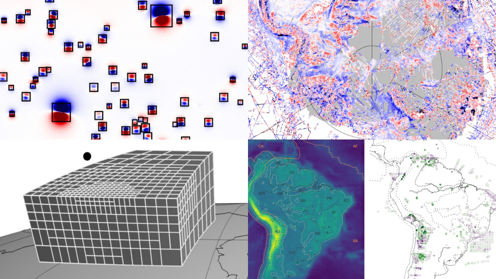



## About us

The **CompGeoLab** is a research group based at the
[{{ config.location.university }}][usp].
We are experts in solving **inverse problems** in the field of **Geophysics**.
For example, determining the inner density distribution of the Earth from
measured disturbances in the Earth's gravity field.
These are the main tools used by geoscientists to **image the inside** of the
Earth and other planets.

We also specialize in building **open-source scientific software**.
Our team works on several tools and projects, both developing
tools in-house and contributing across the larger scientific ecosystem.

[usp]: https://www.iag.usp.br/
