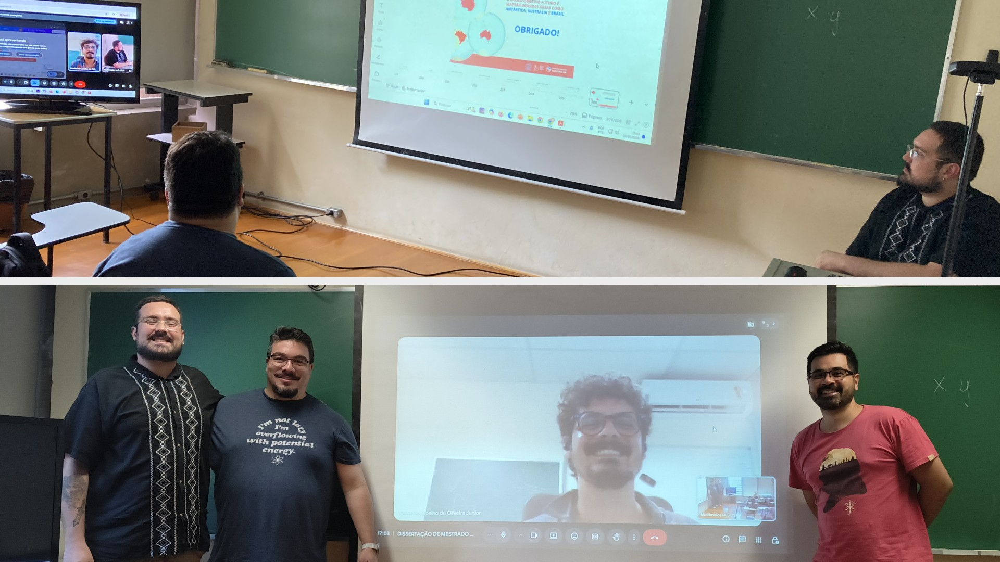

Last Friday, [Arthur](../team#arthursmacedo) successfully defended his
dissertation, earning the title of MSc in Geophysics!
The examination committee had lots of questions which Arthur handled really
well, demonstrating his proficiency with the work to which dedicated the past
two years. The committee also had plenty of praise for the work and for how
Arthur handled the presentation and questions.
I couldn't have been prouder of him!

<figure>

<figcaption>
Top: Arthur (right) answering questions by the examination committee: <a href="https://orcid.org/0000-0002-5747-1474">Marco Couto
Junior</a> (middle) and <a href="https://www.pinga-lab.org/people/oliveira-jr.html">Vanderlei C. Oliveira Jr.]</a> (remotely over video
conference on the right).
Bottom: Arthur, Marco, Vanderlei (projected), and me (left to right) after the
result was announced.
</figcaption>
</figure>

It was a pleasure to work alongside Arthur for the past two years and watch his
growth into a competent and dedicated scientist. What's even better is that
he'll stay with the lab for the next four years to pursue his PhD (more on
that in the future)!

Leo
