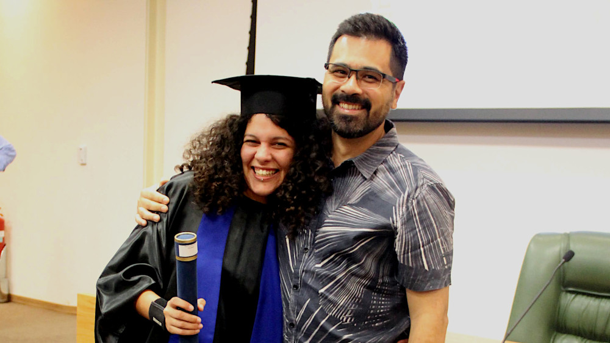

Last month, lab member [Ellen](../team#fernandesellen) graduated from her
Bachelor's degree in Geophysics at the Universidade de São Paulo! It was long
road with more setbacks than usual due to the COVID pandemic but Ellen made it
through. We had the huge pleasure of working with her this past year while she
undertook her final year dissertation project. She defended her Bachelor's
thesis "Quantifying the quality of data interpolation from potential methods by
equivalent sources using block cross-validation" and was approved with lots of
praise from the evaluation committee!

<figure>

<figcaption>
Ellen and me at her graduation ceremony after receiving her diploma.
</figcaption>
</figure>

Ellen will be taking a break from studies but hopes to rejoin USP and the team
for a Master's degree in the near future.
In the meantime, we wish Ellen all the best in her career and hope to have her
with us again soon!

**Please join me in wishing our brand new graduate geophysicist all the best in
her future career!** 🥂

Leo
