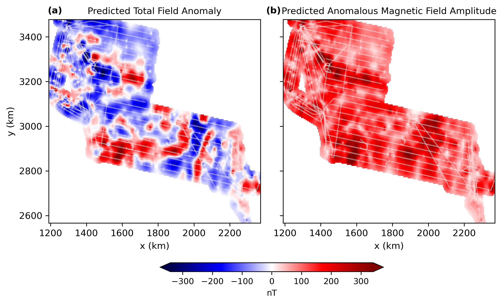

Our new [paper](https://doi.org/10.1093/gji/ggaf359) has been published in
Geophysical Journal International! 🎉 It introduces **Dual-Layer Magnetic
Equivalent Sources**, a new adaptation of the equivalent source technique for
gridding magnetic data.

> Uppal, I., Uieda, L., Oliveira Jr., V. C., Holme, R. (2025). Dual-Layer
> Gradient-Boosted Equivalent Sources for Magnetic Data. *Geophysical Journal
> International*.
> doi:[10.1093/gji/ggaf359](https://doi.org/10.1093/gji/ggaf359)

We’re excited about this method because it addresses some of the limitations
current adaptions of the equivalent source technique still have. This
dual-layer approach enhances the computational efficiency and improves the
predictions compared to a single layer approach when predicting both short-
and long-wavelength signals, particularly in the presence of truncated
long-wavelength anomalies. The method can also be used to fit total field
anomaly data and then predict the three components of the anomalous magnetic
field, as well as the amplitude of the anomalous magnetic field.

**Open science:**
As always, all of the source code and data needed to reproduce our results are
openly available and can be accessed via the:

 - Github repository: [compgeolab/eqs-magnetic-dual-layer](https://github.com/compgeolab/eqs-magnetic-dual-layer)
 - Zendodo archive: [10.5281/zenodo.15120457](https://doi.org/10.5281/zenodo.15120457)

We’ll also be implementing a version of the dual-layer magnetic equivalent
sources in the Python library [Harmonica](https://www.fatiando.org/harmonica/latest/) as well.

Here’s a sneak peek of one of our main results from applying dual-layer
magnetic equivalent sources to an aeromagnetic dataset from Antarctica:

<figure>
  
  <figcaption> The real data predictions on a regular grid using the dual-layer magnetic equivalent sources approach. The prediction of the total-field anomaly (a) and amplitude of the anomalous magnetic field (b) of the ICEGRAV survey (Ferraccioli et al., 2020) on a regular grid with 5km spacing. The survey lines are overlaid in white.</figcaption>
</figure>

This work is part of [my](../team/#indiauppal) PhD thesis, motivated by our goal to improve the quality of existing Antarctic magnetic data products. Existing methods are often not ideal for stitching together such complex surveys and we saw equivalent sources as a promising way forward. With this paper, the results serve as the basis for further exploration into the challenging Antarctic magnetic datasets. This paper was completed with the help of my supervisors, [Leo Uieda](../team/#leouieda), [Vanderlei C. Oliveira Jr.](https://www.pinga-lab.org/people/oliveira-jr.html) and [Richard Holme](https://www.liverpool.ac.uk/people/richard-holme).

## Abstract
Magnetic data often require interpolation onto a regular grid at constant
height before further analysis. A widely used approach for this is the
equivalent sources technique, which has been adapted over time to improve its
computational efficiency and accuracy of the predictions. However, many of
these adaptations still face challenges, including border effects in the
predictions or reliance on a stabilising parameter. To address these
limitations, we introduce dual-layer gradient-boosted equivalent sources to:
(1) use a dual-layer approach to improve the predictions of both short- and
long-wavelength signals, as well as, reduce border effect; (2) use
block-averaging and the gradient-boosted equivalent sources method to reduce
the computational load; (3) apply block K-fold cross-validation to guide
optimal parameter selection for the model. The proposed method was tested on
both synthetic datasets and the ICEGRAV aeromagnetic dataset to evaluate the
methods ability to interpolate and upward continue onto a regular grid, as
well as predict the amplitude of the anomalous field from total-field anomaly
data. The dual-layer approach proved better compared to the single-layer
approach when predicting both short- and long-wavelength signals, particularly
in the presence of truncated long-wavelength anomalies. The use of
block-averaging and the gradient-boosting method enhances the computational
efficiency, being able to grid over 400,000 data points in under 2 minutes on
a moderate workstation computer.
