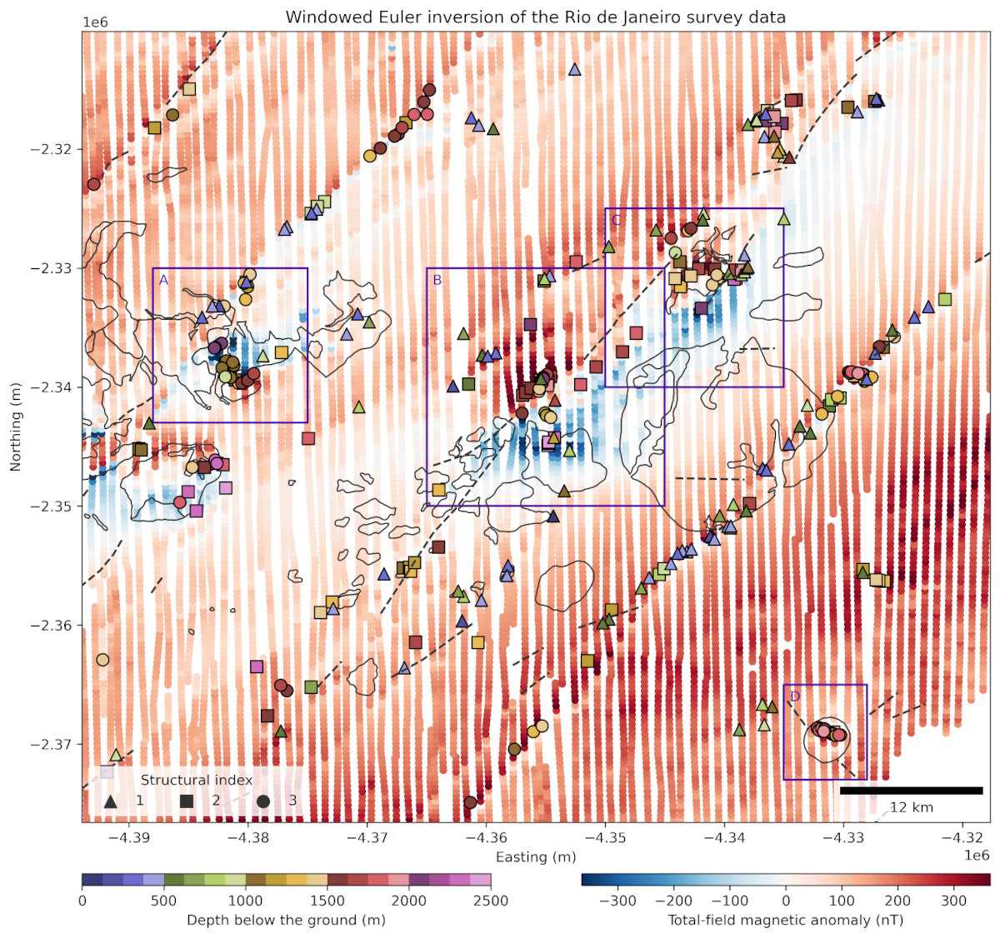

We have a new [preprint out on EarthArXiv](https://doi.org/10.31223/X5T41M)
which introduces **Euler inversion**, a new method for finding the location and
approximate geometry of sources of gravity and magnetic anomalies.

We're very excited about Euler inversion because it's a significant departure
from existing methods based on Euler's homogeneity equation (mainly Euler
deconvolution and its many many variants). It's a brand new mathematical
formulation which solves many of the existing issues Euler-based methods,
mainly: high sensitivity to noise and interfering sources and the dependence on
knowledge of the structural index of the sources.
This opens a new research field for us as we continue to improve it further and
to explore the capabilities of Euler inversion in difference scenarios!

**Open science:**
As always, all of the source code and data needed to reproduce our results are
in the GitHub repository
[compgeolab/euler-inversion](https://github.com/compgeolab/euler-inversion)
and archived on figshare at
doi:[10.6084/m9.figshare.26384140](https://doi.org/10.6084/m9.figshare.26384140).
We'll soon have a version of Euler inversion implemented in the Python library
[Harmonica](https://www.fatiando.org/harmonica/latest/) as well.

Here's a sneak peek at our main result from applying Euler inversion to an
aeromagnetic dataset from Rio de Janeiro, Brazil:

<figure>
  
  <figcaption>Results of applying Euler inversion with a window size of 12 000 m and a window step of 2400 m to the aeromagnetic data from Rio de Janeiro, Brazil. Estimated source locations and structural indices obtained from Euler inversion are shown as triangles (𝜂 = 1), squares (𝜂 = 2), and circles (𝜂 = 3). The colour of each symbol represents the estimated depth below the surface of the Earth (topography). Also shown are the total-field anomaly flight-line data, the contours of the post-collisional magmatism and alkaline intrusions (solid black lines) and dykes (dashed lines). The purple squares highlight the A, B, C, and D anomalies that are discussed in the text.</figcaption>
</figure>

The main idea for this paper came about during an potential-field methods class
which I took in 2012 with my then PhD supervisor [Valéria C. F.
Barbosa](https://www.pinga-lab.org/people/barbosa.html).
While learning about the Euler deconvolution method, which is a speciality of
Valéria, I connected it with the geodetic network adjustment theory that I had
been taught by [Spiros Pagiatakis](https://www.yorku.ca/spiros/spiros.html)
during an exchange program at York University, Canada, in 2008. An initial
prototype was developed in 2012 but there were still some rough edges and the
project was shelved to make way for other more urgent projects at the time.
I returned to this every few years, making slow progress, and involving
[Vanderlei C. Oliveira Jr.](https://www.pinga-lab.org/people/oliveira-jr.html)
in the planning and discussion of the theory.
In 2024, lab members [Gelson](../team/#Souza-junior) and
[India](../team/#indiauppal) joined me and Vanderlei for a sprint to finish the
method and produce this paper.

Here's the full reference for the preprint:

> Uieda, L., Souza-Junior, G. F., Uppal, I., Oliveira Jr., V. C. (2024). Euler
> inversion: Locating sources of potential-field data through inversion of
> Euler’s homogeneity equation. EarthArXiv.
> doi:[10.31223/X5T41M](https://doi.org/10.31223/X5T41M).

We have submitted this to the Geophysical Journal International and are waiting
for their reviews. Hopefully everything will work out and we'll get a nice
surprise in the new year when a decision comes back from the editor!

**If you have any feedback or would like to use the method**, please let us
know!

## Abstract

Earth scientists can estimate the depth of certain rocks beneath Earth's
surface by measuring the small disturbances that they cause in the Earth's
gravity and magnetic fields. A popular method for this is **Euler
deconvolution**, which is widely available in geoscience software and can be
run quickly on a standard computer. Unfortunately, Euler deconvolution has some
shortcomings: 1) the approximate shape of the rocks must be known, for example,
a sphere or a wide flat slab, represented by the **structural index** 2) the
depth of the rocks is not well estimated when there is noise in our data, which
is a common occurrence. We propose a new method, **Euler inversion**, which
fixes some of the shortcomings of Euler deconvolution by using more adequate
(and complex) mathematics. Our method is less sensitive to noise in the data
and is also able to determine the approximate shape of the source (the
structural index). Euler inversion is also fast to execute on a standard
computer, making it a practical alternative to Euler deconvolution on an Earth
scientists toolbox.
