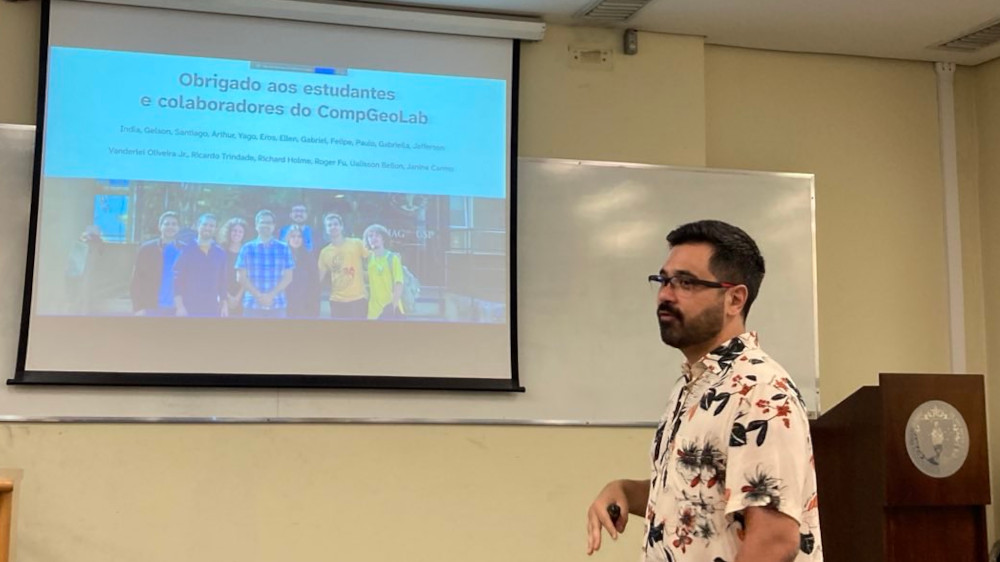

I'm very happy to share that last week **I was awarded the degree of "Livre Docente" (Dr.
habil.)** from Universidade de São Paulo!
This is the highest degree that one can earn after a PhD. In many European
countries this is called
[Habilitation](https://en.wikipedia.org/wiki/Habilitation). At USP, it's
a requirement for promotion to Professor Associado, which will hopefully come
in the next couple of months.

Attaining this degree involves written and teaching exams and the defense of
a [thesis](https://doi.org/10.6084/m9.figshare.28791908)
and a
["memorial"](https://doi.org/10.6084/m9.figshare.28737800)
(in portuguese), which is a long form narrative CV that includes reflections on
our experiences. The thesis is a compilation of the work of the wonderful
graduate researchers and CompGeoLab members Santiago Soler, India Uppal, and
Gelson Souza-Junior.

<figure>
  
  <figcaption>Photo of me during my thesis defense. Photo credit: Ana Caroline
  Colombo.</figcaption>
</figure>

My examination committee was composed of <a
href="https://lattes.cnpq.br/2170299963939072">Walter Eugênio de
Medeiros</a> (UFRN), <a
href="https://lattes.cnpq.br/8572311134832725">Roberta Mary Vidotti</a>
(UnB), <a href="https://lattes.cnpq.br/6186195219221290">Gelvam André
Hartmann</a> (UNICAMP), <a href="https://lattes.cnpq.br/8918399592544099">
Mauricio de Souza Bologna</a> (USP), and <a
href="https://lattes.cnpq.br/9384664464941402">Carlos Alberto Mendonça</a>
(USP), all of whom are experts in their fields and well respected.
Their feedback was very positive and constructive and I certainly learned a lot
from them during the examination.
It was a very exhausting experience, with two full days
of exams, but also very rewarding to see all of my effort being recognized
by the committee.
