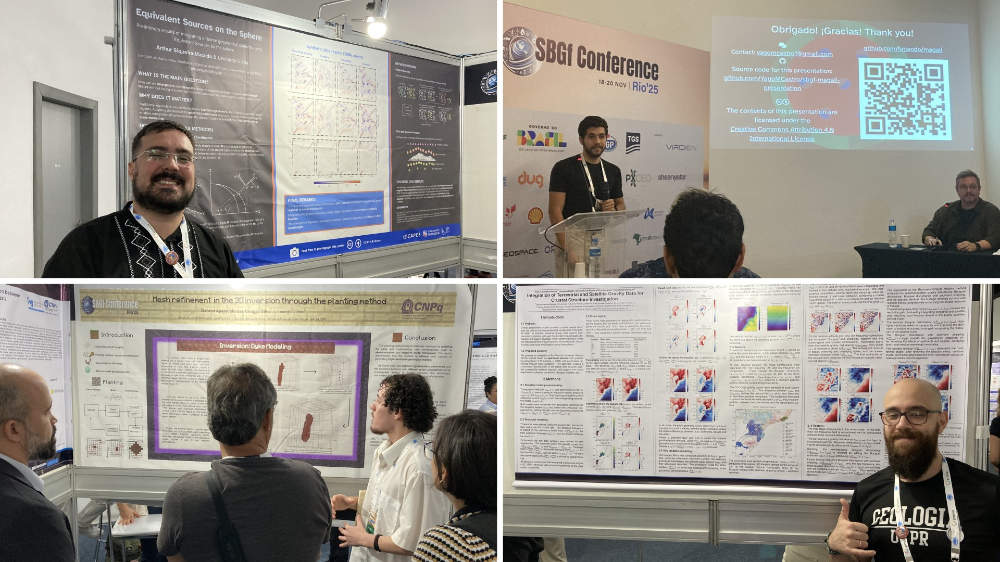

2025 is drawing to a close and I'd like to end it with a brief retrospective of
all that happened in the Lab this past year.
Overall, it was a great and productive year, with some ups and downs, busy
moments, good reviews, bad reviews, but altogether good time with great people.
So here's a (probably not comprehensive) list of all we did:

1. [Gelson](../team#Souza-junior) came back to São Paulo after spending a year
   at Harvard University making tons of measurements on our collaborator
   [Roger Fu](https://eps.harvard.edu/people/roger-fu/)'s Quantum Diamond
   Microscope. All of his hard work resulted in a [preprint about a huge
   improvement to his inversion method](https://doi.org/10.31223/X5N42F),
   a [preprint about non-dipolar effects in
   microscopy](https://doi.org/10.22541/essoar.176071652.24509178/v1) (in
   collaboration with [Ualisson Bellon](https://ualissonbellon.wixsite.com/magnetic-records) from Edinburgh), and
   [tons of datasets](https://doi.org/10.5281/zenodo.15132658) for us to
   analyse! There will actually be two more results coming out of this 1-year
   stay at Harvard which we hope to share with everyone in 2026.
1. [India](../team#indiauppal) had her first first-author [paper
   published](https://doi.org/10.1093/gji/ggaf359), which contains some really
   unexpected results from applying a dual-layer setup to equivalent sources
   interpolation of magnetic data. This will be the basis for a lot of the work
   the Lab will be doing in the coming years!
1. I had the chance to finally work on a [paper I started in
   2012](https://doi.org/10.1093/gji/ggaf114) which introduces *Euler
   Inversion*, a brand new formulation of the Euler deconvolution problem which
   is much more stable and robust.
1. [Gabriel](../team#chagas-gabriel) completed his undergraduate research
   project on 3D inversion of gravity data and is starting a new one revisiting
   a relationship between the Bouguer gravity disturbance and topography.
1. Undergraduate researchers Felipe Nascimento Hong, Paulo Eduardo Crystal, and
   Sofia Vieira dos Santos have joined the lab and will be working on all sorts
   of problems related to potential fields in the coming year. They bring a lot
   of new life into the Lab and I'm really excited to share what they
   accomplish in 2026!
1. [Arthur](../team#arthursmacedo) and [Yago](../team#YagoMCastro) presented
   their MSc projects at the [8th LATINMAG Meeting](https://latinmag.geofisica.unam.mx/index.html) in Morelia, Mexico.
1. [Eros](../team#ErosKerouak), Gabriel, Arthur, and Yago presented their work
   at the [Rio'25 Conference](https://www.rio25.sbgf.org.br/) of the SBGf. All
   of them received a ton of praise for their work and I was so proud of all of
   them!
1. Me, Yago, and Arthur taught the workshop ["Kit de sobrevivência digital para
   cientistas"](https://github.com/compgeolab/kit) at the [IAG Geophysics
   Summer School](iag-summer-school-2025.html) which was really well received
   by the participants and which we'll be teaching again in 2026.

<figure>

<figcaption>
Photos of Arthur (top left), Yago (top right), Gabriel (bottom left), and Eros
(bottom right) presenting their work at the Rio'25 Conference in Rio de
Janeiro in November.
</figcaption>
</figure>

All in all, it was a great year and I couldn't have asked for a better group of
people with which to spend it.
I'm so proud of all that they have achieved in 2025 and I'm really looking
forward to 2026!

Leo
