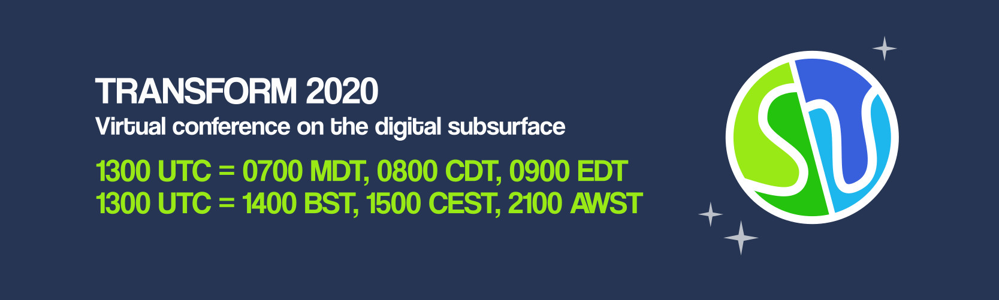

The [Software Undergroudn](https://softwareunderground.org/) is organizing a
massive free online event next week:

[Leo][/people/uieda] and [Santiago][/people/santisoler] will be teaching the
tutorial
"[From scattered data to gridded products using Verde](https://transform2020.sched.com/event/c7KE/tutorial-from-scattered-data-to-gridded-products-using-verde)".
The session will be [live-streamed to
YouTube](https://www.youtube.com/watch?v=-xZdNdvzm3E) and will still be
available after the event:

<iframe width="560" height="315" src="https://www.youtube-nocookie.com/embed/-xZdNdvzm3E" frameborder="0" allow="accelerometer; autoplay; encrypted-media; gyroscope; picture-in-picture" allowfullscreen></iframe>

There will be many other interesting tutorials, discussions, and lightning
talks. You can register and browse the schedule on the
[Transform2020 Sched page](https://transform2020.sched.com).
