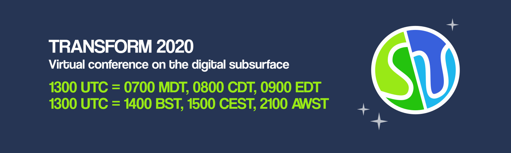

The [Software Underground](https://softwareunderground.org/) is organizing a
massive free online event next week:
[Transform2020 Virtual Conference on digital subsurface](https://transform2020.sched.com/).

Leo and Santiago will be teaching the tutorial
"[From scattered data to gridded products using Verde](https://transform2020.sched.com/event/c7KE/tutorial-from-scattered-data-to-gridded-products-using-verde)".
The session will be [live-streamed to
YouTube](https://www.youtube.com/watch?v=-xZdNdvzm3E) and will still be
available after the event.

There will be many other interesting tutorials, discussions, and lightning
talks. You can register and browse the schedule on the
[Transform2020 Sched page](https://transform2020.sched.com).
