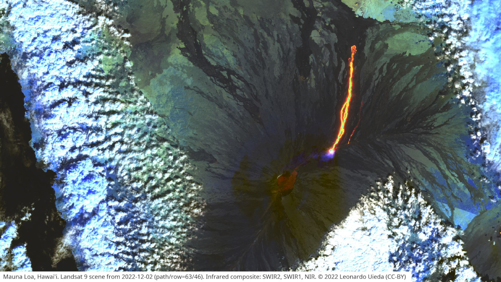

# {{ page.title }}

Our team work on several open-source software projects and contribute across
the scientific Python ecosystem.

## Fatiando a Terra

A collection of Python tools for geophysics. The Fatiando tools are the heart
of most of our research and teaching efforts. This is the main project on which
we work.

<a class="btn btn-primary mb-2 me-3" target="_blank" href="https://www.fatiando.org">
  <i class="fas fa-home me-1" aria-hidden="true"></i> Website
</a>
<a class="btn btn-outline-primary mb-2 me-3" target="_blank" href="https://github.com/fatiando">
  <i class="fab fa-github me-1" aria-hidden="true"></i> GitHub
</a>
<a class="btn btn-outline-primary mb-2 me-3" target="_blank" href="https://badge.dimensions.ai/details/id/pub.1125086757">
  <i class="fas fa-graduation-cap me-1" aria-hidden="true"></i> Citations
</a>

## xlandsat

A small Python library for loading Landsat multi-spectral remote sensing scenes
from downloaded from [USGS EarthExplorer](https://earthexplorer.usgs.gov/) into
``xarray.Dataset`` containers. It takes care of reading the metadata and
organizing the bands into a single data structure for easier manipulation,
processing, and visualization.

<a class="btn btn-primary mb-2 me-3" target="_blank" href="https://www.compgeolab.org/xlandsat">
  <i class="fas fa-home me-1" aria-hidden="true"></i> Website
</a>
<a class="btn btn-outline-primary mb-2 me-3" target="_blank" href="https://github.com/compgeolab/xlandsat">
  <i class="fab fa-github me-1" aria-hidden="true"></i> GitHub
</a>

## The Generic Mapping Tools

GMT is one of the most widely used and loved open-source software in the
geosciences.
Our team contributes to both GMT and the [PyGMT](https://www.pygmt.org)
library which brings all the power of GMT to the Scientific Python ecosystem.

<a class="btn btn-primary mb-2 me-3" target="_blank" href="https://www.generic-mapping-tools.org">
  <i class="fas fa-home me-1" aria-hidden="true"></i> Website
</a>
<a class="btn btn-outline-primary mb-2 me-3" target="_blank" href="https://github.com/GenericMappingTools">
  <i class="fab fa-github me-1" aria-hidden="true"></i> GitHub
</a>
<a class="btn btn-outline-primary mb-2 me-3" target="_blank" href="https://badge.dimensions.ai/details/id/pub.1120863611">
  <i class="fas fa-graduation-cap me-1" aria-hidden="true"></i> Citations
</a>

## Tesseroids

A collection of command-line programs for modeling the gravitational potential,
acceleration, and gradient tensor. Tesseroids supports models and computation
grids in Cartesian and spherical coordinates.

<a class="btn btn-primary mb-2 me-3" target="_blank" href="https://tesseroids.leouieda.com">
  <i class="fas fa-home me-1" aria-hidden="true"></i> Website
</a>
<a class="btn btn-outline-primary mb-2 me-3" target="_blank" href="https://github.com/leouieda/tesseroids">
  <i class="fab fa-github me-1" aria-hidden="true"></i> GitHub
</a>
<a class="btn btn-outline-primary mb-2 me-3" target="_blank" href="https://badge.dimensions.ai/details/id/pub.1064143907">
  <i class="fas fa-graduation-cap me-1" aria-hidden="true"></i> Citations
</a>

